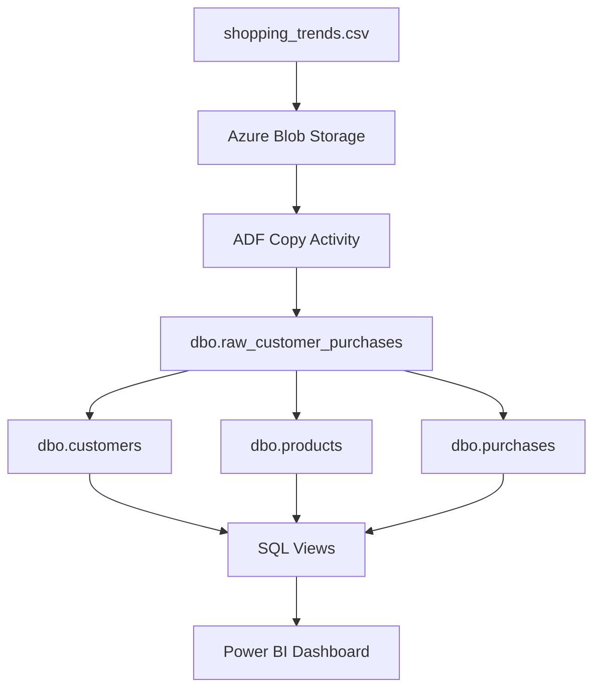

# Azure Cloud Data Pipeline - Scenario 2: Shopping Trends Analysis

**Course:** CST8911 - Cloud Development and Operations  
**Institution:** Algonquin College  
**Project Date:** March 2026

---

##  Project Overview
This project demonstrates an end-to-end cloud data pipeline for Scenario #2 (Data Engineering & Power BI). Our team chose this scenario specifically for its **Parallel Workflow** capabilities, allowing us to build a high-availability infrastructure, automated ETL pipelines, and interactive analytics dashboards within a strict one-week timeline.

By selecting Scenario #2, we minimized "Hard Blocks" and focused on a divisible architecture where data cleaning, infrastructure deployment, and visualization could happen simultaneously.

##  The Team & Project Delegation
To ensure maximum efficiency, we delegated roles based on the specific pillars of Cloud Architecture and Data Engineering:

| Role | Responsibility | Primary Output |
| :--- | :--- | :--- |
| **Member 1: Data Lead** | **Ruaa Thamer** | Data sourcing (Kaggle), standardization (Snake_Case), and Azure Blob Staging (Hot Tier). |
| **Member 2: Azure Admin** | **Vijayxavier Walter** | Infrastructure deployment (Azure SQL & Data Factory) and RBAC security configuration. |
| **Member 3: ETL Developer** | **Thomas Dehaancarriere** | ADF Pipeline orchestration and automated data ingestion from Blob to SQL. |
| **Member 4: SQL Architect** | **Ilyas Zazai** | T-SQL normalization, schema design, and creating optimized Views for reporting. |
| **Member 5: BI Designer** | **Faiza Boudehane** | Power BI connectivity and development of the final interactive analytical dashboard. |

##  Technical Strategy
* **Parallel Workflow:** While the infrastructure was being provisioned, the Data Lead and SQL Architect worked on data cleaning and schema logic to ensure zero downtime.
* **Risk Mitigation:** We chose a modular design; if the automated ADF pipeline required troubleshooting, the SQL Architect could maintain progress using staged data, ensuring the project remained on schedule.
* **Visual Impact:** The end goal was a polished Power BI dashboard that provides immediate business insights from raw cloud-staged data.

## Architecture 

---
